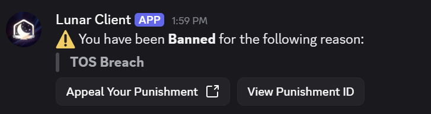

# LunarClientXSS
Stored and replicated XSS leading to Arbitrary Command Execution in the Lunar Client (Disclosed &amp; Patched)

## Summary

Lunar Client appears to render mod descriptions (from CurseForge / Modrinth sources) in a context that allows JavaScript execution. This results in a stored/reflected XSS condition.

Because the embedded context exposes privileged Lunar APIs, this XSS can be escalated to arbitrary command execution on the user’s machine.

---

## Vulnerability Details

- **Component:** Mod description rendering (CurseForge / Modrinth integration in Lunar Client)
- **Issue:** Unsanitized HTML allows JavaScript execution
- **Impact:** XSS -> invocation of privileged Lunar Client APIs -> command execution

---

## Steps to Reproduce

1. Inject a malicious HTML payload into a mod description (or simulate via local endpoint)
2. Open Lunar Client and view the mod description in the UI
3. JavaScript executes in context with access to `parent.lunar` APIs
4. Execute the following payload:

```js
await parent.lunar.profiles.setPreLaunchCommand("calc.exe");
await parent.lunar.launch.launchGame({});
```

### Example Malicious HTML Payload (POC)
```html
<iframe srcdoc="<script>parent.lunar.profiles.setPreLaunchCommand('calc.exe')</script>" width="120" height="50"></iframe> 
```

### Closing Summary
By utilizing CurseForge and Modrinth someone would be able to deploy a malicious payload that Lunar failed to sanitize leading to XSS in the Lunar Client on viewing a mod/resource pack page. Since this XSS executes in a context with access to `parent.lunar` APIs we can then set a pre-launch command and force launch the game via `parent.lunar.launch.launchGame({});` to instantly compromise the host machine.

### Disclosure
This vulnerability was responsibly disclosed to Lunar Client and has since been patched, they decided to ban me from the Discord server for disclosing this with the reason "TOS Breach", leaving me with no viable options to responsibly disclose any future vulnerabilities to them. I was not expecting a bug bounty for this work I just wanted to bring light to the issue.


